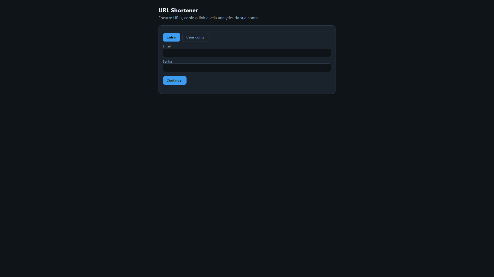

# URL Shortener

Serviço em **Go** que transforma URLs longas em links curtos, redireciona em poucos milissegundos e registra analytics de cliques **sem** colocar o banco no caminho crítico.

Projeto de portfólio: API REST, JWT, cache Redis, PostgreSQL, métricas Prometheus, Docker Compose e uma UI simples.



**No seu PC:** [http://localhost:8080](http://localhost:8080)

## Por que existe

Encurtador de URL é um produto batido. O que importa aqui é o **caminho de um clique**:

- O redirect lê no **Redis** (cache-aside); o PostgreSQL é a fonte da verdade.
- Cada clique vai com **`XADD` para um Redis Stream**. O handler HTTP devolve `302` na hora. Um worker persiste o evento.
- Códigos curtos são **base62** aleatório (7 caracteres), com constraint unique e retry em colisão.
- IP entra só como **SHA-256(salt + IP)**, nunca em texto puro.

Numa máquina local com Docker Desktop (cache quente, 50 clientes concorrentes, **sem** seguir o 302): **~3200 redirects/s**, **p95 ≈ 33ms**.

## Funcionalidades

- Cadastro / login / **sair** (JWT) e criação de links pela UI ou pela API
- Alias customizado (`meu-link`) e data de expiração (opcionais)
- `GET /{codigo}` público → `302`, ou `410` se o link expirou ou foi desativado
- Analytics só do dono: total, por dia, top referrers, dispositivo/navegador
- Rate limit: 100 criações por hora por usuário
- `/health` e `/metrics` (Prometheus)

## Quick start (Windows)

Precisa do **Docker Desktop**. GNU Make **não** é necessário.

```powershell
cd URLshortner
.\make.ps1 up
```

Abra [http://localhost:8080](http://localhost:8080), crie uma conta, cole uma URL (alias opcional tipo `meu-link`) e copie o curto. **Sair** no topo encerra a sessão.

```powershell
.\make.ps1 down    # parar
.\make.ps1 logs    # logs da API
.\make.ps1 smoke   # health + register + alias com hífen + redirect
```

Equivalente direto: `docker compose up --build -d`

| Sistema | Subir |
|---------|--------|
| Windows PowerShell | `.\make.ps1 up` |
| Windows cmd | `make.cmd up` |
| macOS / Linux (com Make) | `make up` |

## Arquitetura

```
Browser / curl  →  Go (chi)
                      ├─ Redis GET  link:{codigo}   (caminho quente do redirect)
                      ├─ Redis XADD clicks          (não bloqueia)
                      └─ Postgres                   (links, users, clicks)
Worker            ←  Redis Streams (consumer group)
```

Decisões: [docs/adr](docs/adr).

## API HTTP

Rotas autenticadas exigem `Authorization: Bearer <access_token>`.

| Método | Caminho | Auth | O que faz |
|--------|---------|------|-----------|
| GET | `/` | não | UI |
| GET | `/health` | não | App + Postgres + Redis |
| GET | `/metrics` | não | Prometheus |
| POST | `/auth/register` | não | `{ "email", "password" }` (senha ≥ 8) |
| POST | `/auth/login` | não | mesmo body → `{ access_token, expires_in, email }` |
| POST | `/auth/logout` | não | `204`; a UI apaga o token local |
| POST | `/links` | sim | `{ "url", "alias"?, "expires_at"? }` → `{ short_code, short_url }` |
| GET | `/links` | sim | Seus links |
| GET | `/links/{codigo}/analytics` | sim | Breakdown de cliques (403 se não for seu) |
| DELETE | `/links/{codigo}` | sim | Soft delete; redirects seguintes dão 410 |
| GET | `/{codigo}` | não | Redirect |

`alias`: letras, números e hífen, 3–20 caracteres, sem começar/terminar com `-` nem hífen duplo. `expires_at` é RFC3339. Duplicado → `409`.

### curl (PowerShell)

`-d '{...}'` inline costuma quebrar. Grave um arquivo e use `--data-binary`.

```powershell
'{"email":"voce@example.com","password":"password1"}' | Set-Content -NoNewline auth.json
curl.exe -s -X POST http://localhost:8080/auth/register -H "Content-Type: application/json" --data-binary "@auth.json"
```

```powershell
'{"url":"https://example.com/caminho","alias":"meu-link"}' | Set-Content -NoNewline link.json
curl.exe -s -X POST http://localhost:8080/links -H "Content-Type: application/json" -H "Authorization: Bearer $TOKEN" --data-binary "@link.json"

curl.exe -sS -D - -o NUL http://localhost:8080/meu-link
```

## Configuração

Tudo por variável de ambiente (o Compose já traz defaults que funcionam).

| Variável | Padrão | Função |
|----------|--------|--------|
| `HTTP_ADDR` | `:8080` | Endereço de listen |
| `DATABASE_URL` | URL local do Postgres | Persistência |
| `REDIS_URL` | `redis://localhost:6379/0` | Cache, rate limit, stream de cliques |
| `PUBLIC_BASE_URL` | `http://localhost:8080` | Host usado em `short_url` |
| `JWT_SECRET` | `dev-jwt-change-me` | **Troque em produção** |
| `IP_HASH_SALT` | `dev-only-change-me` | **Troque em produção** |
| `RATE_LIMIT_CREATE_PER_HOUR` | `100` | Teto de criação por usuário (fallback IP) |
| `CACHE_TTL` | `24h` | TTL do cache de redirect |
| `MIGRATIONS_PATH` | `file://migrations` | `file:///migrations` na imagem |

Postgres e Redis **não** são publicados no host; só a API escuta na `8080`.

## Testes e CI

```powershell
.\make.ps1 test    # go test via Docker
.\make.ps1 lint
.\make.ps1 smoke   # Compose precisa estar no ar
```

No GitHub Actions: `go test ./...` e `golangci-lint` a cada push/PR.

## Teste de carga (redirect)

Aqueça o cache com um GET e **não** siga o redirect.

```bash
docker run --rm williamyeh/hey -z 10s -c 50 -disable-redirects \
  "http://host.docker.internal:8080/${CODE}"
```

| Ferramenta | Carga | RPS | Latência |
|------------|-------|-----|----------|
| hey `-z 10s -c 50` | 10s | **3215** | p95 **32.8ms** |
| wrk `-t4 -c50 -d10s` | 10s | **3152** | p90 29.2ms, p99 60.5ms |

Números de 19/09/2026, Windows + Docker Desktop, com logs JSON por request ligados.

## Stack

Go 1.23 · chi · pgx · Redis · golang-migrate · cliente Prometheus · JWT (HS256) · bcrypt · Docker Compose

## Fora deste repositório

Grafana (faça scrape de `/metrics` se quiser um dashboard). Sem checagem de reputação de domínio. JWTs não são revogados no servidor antes do expiry (`Sair` só apaga o token no browser). Se o `XADD` no Redis falhar, o clique pode se perder; o redirect ainda acontece.

## Produção (opcional): Azure + Cloudflare

Não é necessário para usar local. Script: [`deploy/azure-vm.ps1`](deploy/azure-vm.ps1) — VM Ubuntu `B1s` em `brazilsouth`, Compose na porta 80 (~US$ 20–25/mês). Quando tiver domínio, DNS A no Cloudflare para o IP da VM.

## Licença

Projeto pessoal / portfólio. Use por sua conta e risco.
