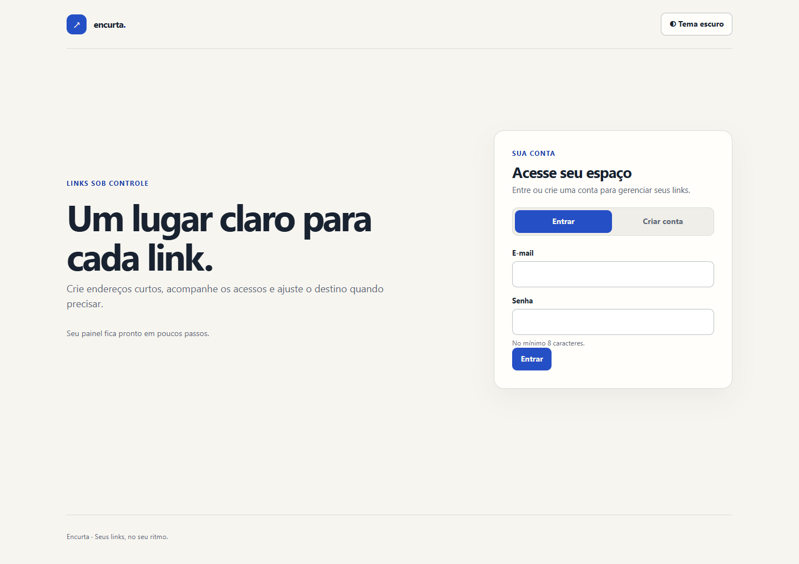
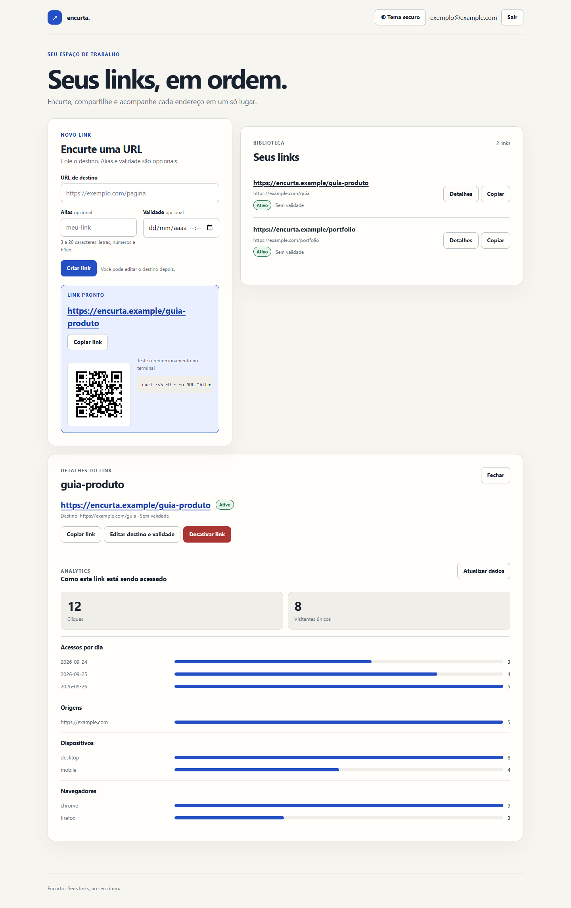

# Encurta

Serviço em **Go** que transforma URLs longas em links curtos. O registro de cliques acontece fora da resposta de redirect; a resolução consulta PostgreSQL quando o link não está no cache Redis.

Projeto de portfólio: API REST, JWT, cache Redis, PostgreSQL, métricas Prometheus, Docker Compose e uma UI simples.

**Documentação:** [apresentação geral](docs/README.md) · [índice por público](docs/INDEX.md) · [guia de uso](docs/user-guide/using.md) · [desenvolvimento local](docs/development/local.md) · [operação local](docs/operations/local.md).





*Capturas da interface atual com dados ilustrativos; o painel usa respostas simuladas.*

## Por que existe

Encurtador de URL é um produto batido. O que importa aqui é o **caminho de um clique**:

- O redirect usa **Redis** quando há cache; em cache miss, consulta o PostgreSQL, que é a fonte da verdade.
- Cada clique vai com **`XADD` para um Redis Stream**. O handler HTTP devolve `302` na hora. Um worker persiste o evento.
- Códigos curtos são **base62** aleatório (7 caracteres), com constraint unique e retry em colisão.
- IP entra só como **SHA-256(salt + IP)**, nunca em texto puro.

Numa máquina local com Docker Desktop (cache quente, 50 clientes concorrentes, **sem** seguir o 302): **~3200 redirects/s**, **p95 ≈ 33ms**.

## Funcionalidades

- Cadastro / login / **sair** (JWT) e criação de links pela UI ou pela API
- Alias customizado (`meu-link`) e data de expiração (opcionais)
- `GET /{codigo}` público → `302`, ou `410` se o link expirou ou foi desativado
- Analytics só do dono: total, visitantes únicos, por dia, top referrers, dispositivo/navegador
- Editar destino, reativar, QR e `curl` de redirect na UI
- Rate limit: criações, auth e redirects públicos
- `/health`, `/metrics` (Prometheus) e `/openapi.yaml`

## Interface

A UI em `/` reúne criação, lista paginada, edição, ativação e analytics no mesmo painel. O tema claro ou escuro pode ser alternado no topo; na primeira visita, a escolha segue o sistema. Os arquivos da interface são embutidos no binário Go e servidos em `/ui/`, sem dependência de CDN.

Na lista, abra **Detalhes** para editar destino ou validade, desativar ou reativar um link e consultar seus acessos. Se a validade passou, ajuste-a antes de reativar. Falhas de rede mantêm os dados já exibidos e oferecem nova tentativa.

Grafana opcional: `docker compose --profile obs up --build -d` e abra [http://localhost:3000](http://localhost:3000) (admin / admin).

## Quick start (Windows)

Precisa do **Docker Desktop**. GNU Make **não** é necessário.

```powershell
# Na raiz do repositório encurta
.\make.ps1 up
```

Abra [http://localhost:8080](http://localhost:8080), crie uma conta, cole uma URL (alias opcional tipo `meu-link`) e copie o curto. **Sair** no topo encerra a sessão.

```powershell
.\make.ps1 down    # parar
.\make.ps1 logs    # logs da API
.\make.ps1 smoke   # health + register + alias com hífen + redirect
```

Equivalente direto: `docker compose up --build -d`

| Sistema | Subir |
|---------|--------|
| Windows PowerShell | `.\make.ps1 up` |
| Windows cmd | `make.cmd up` |
| macOS / Linux (com Make) | `make up` |

## Arquitetura

```
Browser / curl  →  Go (chi)
                      ├─ Redis GET  link:{codigo}   (caminho quente do redirect)
                      ├─ Redis XADD clicks          (não bloqueia)
                      └─ Postgres                   (links, users, clicks)
Worker            ←  Redis Streams (consumer group)
```

Decisões: [docs/adr](docs/adr).

## API HTTP

Rotas autenticadas exigem `Authorization: Bearer <access_token>`.
A [especificação OpenAPI](internal/web/openapi.yaml) é a referência de contrato; a [página da API](docs/reference/api.md) traz exemplos e regras de uso.

| Método | Caminho | Auth | O que faz |
|--------|---------|------|-----------|
| GET | `/` | não | UI |
| GET | `/openapi.yaml` | não | OpenAPI 3 |
| GET | `/health` | não | App + Postgres + Redis |
| GET | `/metrics` | token se `METRICS_TOKEN` | Prometheus |
| POST | `/auth/register` | não | `{ "email", "password" }` (senha ≥ 8) |
| POST | `/auth/login` | não | mesmo body → `{ access_token, expires_in, email }` |
| POST | `/auth/logout` | não | `204`; a UI apaga o token local |
| POST | `/links` | sim | `{ "url", "alias"?, "expires_at"? }` → `{ short_code, short_url }` |
| GET | `/links` | sim | Página `{ links, total, limit, offset }` |
| PATCH | `/links/{codigo}` | sim | `{ "url"?, "expires_at"?, "is_active"? }` |
| GET | `/links/{codigo}/analytics` | sim | Breakdown de cliques (404 se não existir ou não for seu) |
| DELETE | `/links/{codigo}` | sim | Soft delete; redirects seguintes dão 410 |
| GET | `/{codigo}` | não | Redirect |

`alias`: letras, números e hífen, 3–20 caracteres, sem começar/terminar com `-` nem hífen duplo. `expires_at` é RFC3339; em `PATCH /links/{codigo}`, a string vazia (`""`) remove a validade. Duplicado → `409`. `GET /links` aceita `limit` (máx. 100) e `offset`.

### curl (PowerShell)

`-d '{...}'` inline costuma quebrar. Grave um arquivo e use `--data-binary`.

```powershell
'{"email":"voce@example.com","password":"password1"}' | Set-Content -NoNewline auth.json
curl.exe -s -X POST http://localhost:8080/auth/register -H "Content-Type: application/json" --data-binary "@auth.json"
```

```powershell
'{"url":"https://example.com/caminho","alias":"meu-link"}' | Set-Content -NoNewline link.json
curl.exe -s -X POST http://localhost:8080/links -H "Content-Type: application/json" -H "Authorization: Bearer $TOKEN" --data-binary "@link.json"

curl.exe -sS -D - -o NUL http://localhost:8080/meu-link
```

## Configuração

Tudo é configurado por variável de ambiente. O Compose fornece valores locais; PostgreSQL e Redis não publicam portas no host. Consulte a [referência canônica de configuração](docs/reference/configuration.md) para padrões, sensibilidade e validações, e a [visão de segurança](docs/security/overview.md) para limites dessas proteções.

## Testes e CI

```powershell
.\make.ps1 test    # go test via Docker
.\make.ps1 lint
.\make.ps1 smoke   # Compose precisa estar no ar
node --test --experimental-test-coverage internal/web/logic.test.cjs  # regras da UI
npm ci
npm run test:ui  # fluxos da UI em Chrome, com API simulada
```

Os testes de navegador usam um servidor local de arquivos e respostas simuladas para cenários de sucesso e erro; não substituem o `smoke` com a API real. É necessário ter Chrome instalado. O teste PostgreSQL só executa com `TEST_DATABASE_URL` apontando para um banco isolado cujo nome termina em `_test` e `TEST_DATABASE_ISOLATED=1`; ele aplica migrações e grava dados de teste. No GitHub Actions, esse banco é provisionado antes de `go test ./...` e `golangci-lint` a cada push/PR.

## Teste de carga (redirect)

Aqueça o cache com um GET e **não** siga o redirect.

```bash
docker run --rm williamyeh/hey -z 10s -c 50 -disable-redirects \
  "http://host.docker.internal:8080/${CODE}"
```

| Ferramenta | Carga | RPS | Latência |
|------------|-------|-----|----------|
| hey `-z 10s -c 50` | 10s | **3215** | p95 **32.8ms** |
| wrk `-t4 -c50 -d10s` | 10s | **3152** | p90 29.2ms, p99 60.5ms |

Números de 19/09/2026, Windows + Docker Desktop, com logs JSON por request ligados.

## Stack

Go 1.23 · chi · pgx · Redis · golang-migrate · cliente Prometheus · JWT (HS256) · bcrypt · Docker Compose

## Fora deste repositório

Sem checagem de reputação de domínio (host privado literal e IPv4 “estranho” tipo `127.1` são recusados; nomes tipo `nip.io` que resolvem para rede interna não são resolvidos no create). JWTs não são revogados no servidor antes do expiry (`Sair` só apaga o token no browser). Se o `XADD` no Redis falhar, o clique pode se perder; o redirect ainda acontece. Grafana local: `docker compose --profile obs up -d`.

## Licença

Projeto pessoal / portfólio. Use por sua conta e risco.
