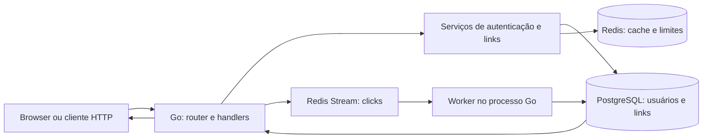

# Arquitetura e dados

O código forma um único serviço Go. Ele serve a UI, a API, o redirect e um worker de cliques no mesmo processo. PostgreSQL guarda usuários, links e cliques; Redis guarda o cache de links, contadores de limite de requisições e o stream de eventos. Evidência: `cmd/api/main.go`, `internal/web/embed.go`, `internal/repository/`.

*Componentes em execução no Compose local.* As setas mostram dependências principais; o desenho não representa um deploy externo. Fontes: `cmd/api/main.go`, `internal/handler/http.go`, `internal/worker/clicks.go`.

## Fluxo de um link

Cadastro e login passam por `internal/handler/http.go` → `internal/service/auth.go` → `internal/repository/postgres/users.go`; senhas são armazenadas como hash bcrypt e a resposta inclui JWT. Rotas sob `/links` exigem token. A criação valida URL, alias e validade no serviço e grava o link no PostgreSQL. Listagem, edição, desativação e analytics consultam dados vinculados ao dono; um link de outra conta é apresentado como não encontrado.

No redirect público, o serviço procura `link:{código}` no Redis. Em cache miss, busca o link no PostgreSQL e tenta povoar o cache; a leitura usa lock compartilhado para coordenar essa operação com escritores. O link só redireciona se estiver ativo e não vencido. Edição e desativação invalidam o cache dentro da transação; falha nessa invalidação impede o commit. Fontes: `internal/service/link.go`, `internal/repository/postgres/store.go`, `internal/repository/redis/cache.go`.

Após resolver um link, o handler prepara metadados do clique, publica no Redis Stream `clicks` e responde `302`. O worker do mesmo processo lê o grupo `click-workers`, grava o evento em `clicks` e confirma a mensagem após sucesso. Falha de publicação pode perder o clique sem impedir o redirect; falha de gravação deixa a mensagem pendente para nova tentativa. Fontes: `internal/handler/http.go`, `internal/worker/clicks.go`, `internal/repository/redis/cache.go`.

## Modelo persistido

As migrações `000001` a `000003` criam `links`, `clicks` e `users`, associam links a donos e acrescentam dispositivo/navegador aos cliques. `links.short_code` é único; `clicks.link_id` referencia `links.id`. As contagens de analytics vêm de consultas SQL em `internal/repository/postgres/store.go`: visitantes únicos são `COUNT(DISTINCT ip_hash)`, dias usam UTC e os dez principais referenciadores são retornados por frequência. Isso é uma contagem por hash, não uma identificação de pessoas.

As decisões registradas estão em [ADRs](../INDEX.md#desenvolver-e-manter). O diagrama e os fluxos acima descrevem o código inspecionado, não uma observação em produção.
